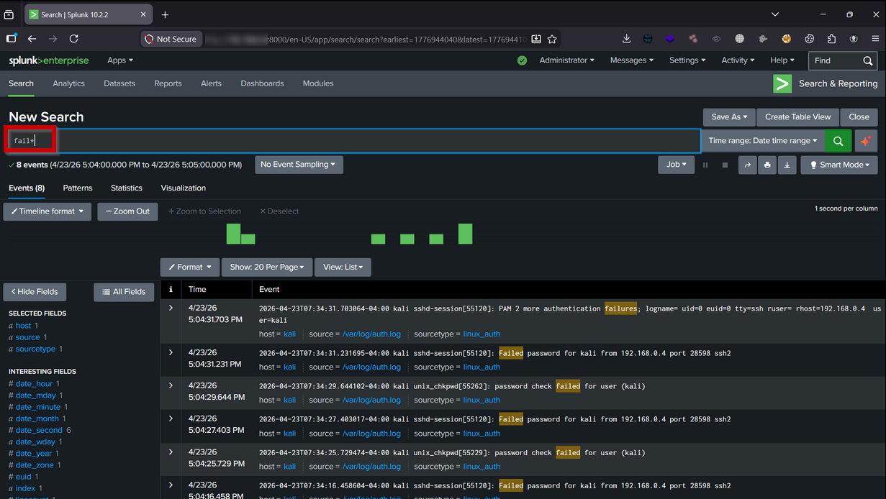
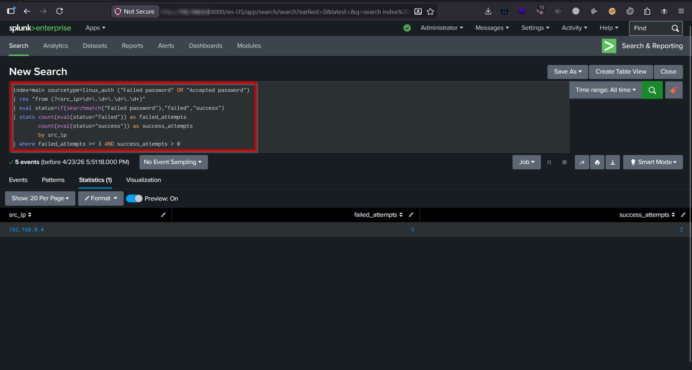
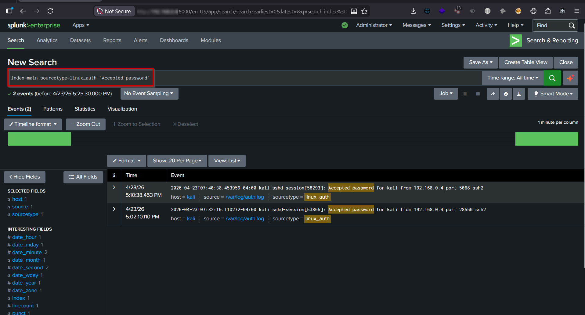
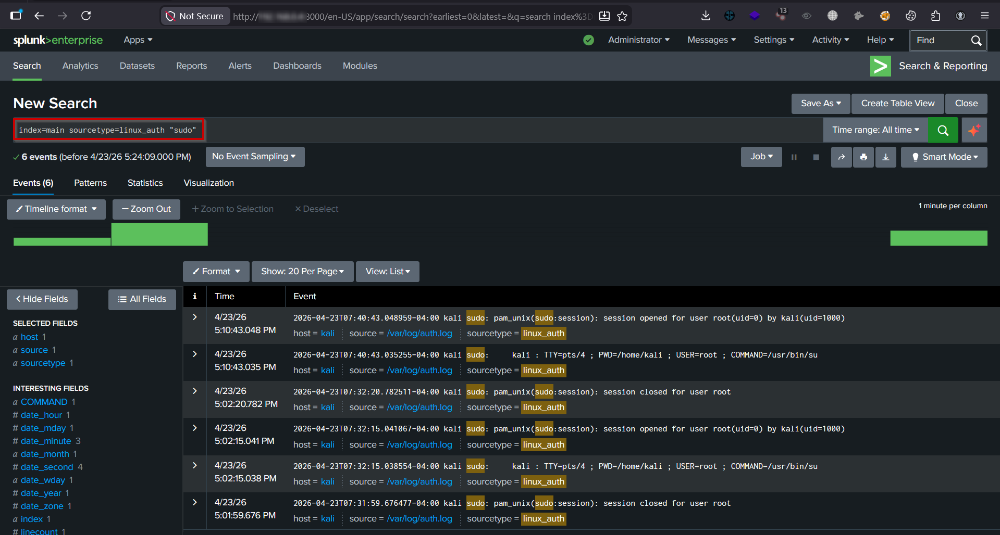
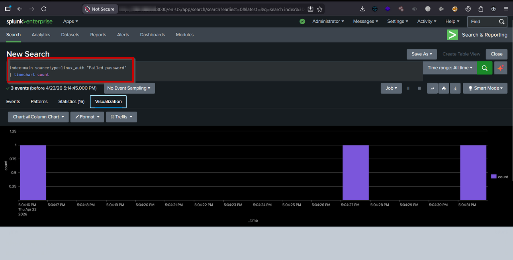

# 🔐 Linux Log Analysis & SSH Attack Detection using Splunk

## 📌 Project Overview

This project demonstrates how to build a **home SOC (Security Operations Center) lab using Splunk** to monitor Linux authentication logs and detect real-world attack scenarios.

The lab simulates attacker behavior and applies log-based detection using **SPL (Splunk Processing Language)**, similar to real SOC environments.

This project simulates real-world attack detection workflows used in **Security Operations Centers (SOC)** , including brute force detection, anomaly identification, and privilege escalation monitoring.

---

## 🧱 Architecture
``` text
Kali Linux (Log Source)
         ↓
Splunk Universal Forwarder
         ↓
Splunk Enterprise (Windows)
         ↓
Detection & Visualization
```

---

## 🧠 Attack Scenario

An attacker performs multiple SSH login attempts using brute force techniques. After several failed attempts, the attacker successfully logs into the system and attempts privilege escalation.

This behavior mimics real-world attacks involving:

- Credential brute force
- Unauthorized access
- Post-compromise activity

## 🎯 Objectives

- Collect Linux logs in Splunk using a forwarder  
- Analyze authentication logs (`auth.log`)  
- Detect brute force login attempts
- Identify successful login after multiple failures  
- Monitor privilege escalation activity  
- Build SOC-style detection queries  

---

## ⚙️ Lab Setup

### 🔹 Splunk Enterprise (Windows)
- Installed and configured Splunk Web (`localhost:8000`)
- Enabled data receiving on port **9997**

### 🔹 Splunk Universal Forwarder (Kali Linux)
- Installed forwarder on Kali Linux
- Connected to Splunk server
- Configured log monitoring:

```bash
/var/log/auth.log
```


---
## 🔍 Detection Logic
### 🔴 1. SSH Brute Force Detection
```text
index=main sourcetype=linux_auth "Failed password"
| rex "from (?<src_ip>\d+\.\d+\.\d+\.\d+)"
| stats count by src_ip
| where count >= 5
```
**Explanation:**

Detects repeated failed login attempts from a single IP, indicating a brute force attack.

### 🔴 2. Brute Force → Successful Login
```text
index=main sourcetype=linux_auth ("Failed password" OR "Accepted password")
| rex "from (?<src_ip>\d+\.\d+\.\d+\.\d+)"
| eval status=if(searchmatch("Failed password"),"failed","success")
| stats count(eval(status="failed")) as failed_attempts 
        count(eval(status="success")) as success_attempts 
        by src_ip
| where failed_attempts >= 3 AND success_attempts > 0
```

**Explanation:**

Identifies potential account compromise where an attacker successfully logs in after multiple failed attempts.

### ⚡ 3. Privilege Escalation Detection
```text
index=main sourcetype=linux_auth "sudo"
```
**Explanation:**

Monitors usage of sudo, which may indicate privilege escalation after initial access.

## 🧪 Attack Simulation

The following activities were performed to generate logs:

### 🔹 Multiple failed SSH login attempts






### 🔹 Successful SSH login




### 🔹 Privilege escalation using sudo




### 🔹 User activity simulation




## 📊 Dashboard

The Splunk dashboard includes:

- Failed login attempts over time
- Top attacker IP addresses
- Successful vs failed login activity
- Privilege escalation monitoring

💡 Key Learnings
- Hands-on experience with Splunk SIEM
- Understanding Linux authentication logs
- Writing detection logic using SPL
- Identifying attack patterns from raw logs
- Troubleshooting log ingestion issues
- Building real-world SOC detection workflows

## 🚨 Challenges & Solutions

| Issue                       | Resolution                               |
| --------------------------- | ---------------------------------------- |
| Forwarder not connecting    | Enabled port 9997 + firewall rules       |
| No logs visible             | Fixed monitor configuration & time range |
| `auth.log` not updating     | Enabled logging service                  |
| SSH connection refused      | Started SSH service                      |
| Detection query not working | Adjusted threshold logic                 |

## 🚀 Future Enhancements
- Integrate Wazuh for advanced detection
- Implement MITRE ATT&CK mapping
- Create automated alerts
- Add advanced correlation rules

## 🔥 Conclusion

This project demonstrates a real SOC workflow:

Log Collection → Analysis → Detection → Visualization

It provides hands-on experience in SIEM operations and threat detection, aligned with real-world SOC analyst responsibilities.

## 📸 Screenshots

All screenshots are available in the `screenshots/` folder.

---

## 👤 Author

### Manoj Kumar S
##### Aspiring SOC Analyst | Cybersecurity Enthusiast

## 🔗 Connect With Me

- 🌐 Portfolio: https://www.cybergodfather.me  
- 💼 LinkedIn: https://linkedin.com/in/manoj-root  
- 🐙 GitHub: https://github.com/Manoj-Root  

---

## ⭐ Support

If you found this project useful, consider giving it a ⭐
